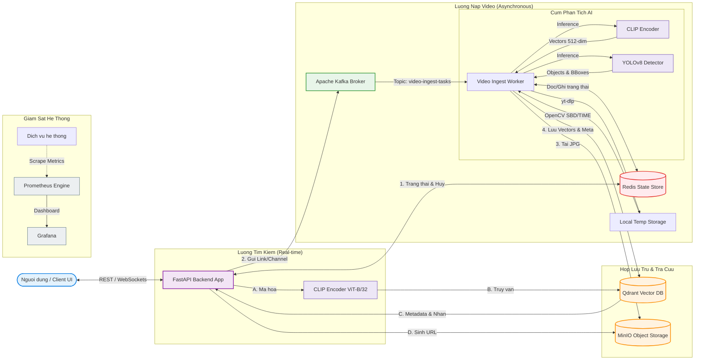

# 🎬 Video Retrieval System - KIS Challenge

Hệ thống **Keyframe-based Image Search (KIS)** cho phép người dùng tìm kiếm phân cảnh video dựa trên mô tả văn bản (Semantic Search) kết hợp với các bộ lọc nhận diện vật thể (Object-based Filtering) và khoảng thời gian (Temporal Search).

Dự án bao gồm cả hệ thống **Nạp Video tự động bất đồng bộ (Automated Video Ingest Pipeline)** hỗ trợ trích xuất ranh giới phân cảnh thông minh (SBD) hoặc theo thời gian (TIME), kết hợp mô hình AI nhúng (CLIP ViT-B/32) và phát hiện đối tượng (YOLOv8).

---

## 🛠️ Kiến trúc Hệ thống Toàn diện

Hệ thống được thiết kế theo mô hình Microservices phân tán, kết nối bất đồng bộ qua hàng đợi thông điệp (Message Queue). Sơ đồ kiến trúc toàn hệ thống bao gồm 6 phân lớp chính:



### Chi tiết các phân lớp:

1. **Lớp Giao diện (Frontend - Web UI)**:
   * **Phần Tìm kiếm**: Form nhập mô tả bằng văn bản hoặc tải lên ảnh tương đương, đi kèm ô lọc theo nhãn vật thể (Hybrid Search). Kết quả hiển thị dạng Grid phân trang, nhấp chuột để mở Carousel xem các khung hình lân cận.
   * **Phần Nạp Video**: Hỗ trợ nhập URL, chọn giải thuật trích xuất (`SBD` / `TIME`), và bảng theo dõi tiến độ thời gian thực (được đẩy liên tục từ WebSocket).
2. **Lớp Gateway & API (FastAPI Backend)**:
   * **Search Controller**: Nhận yêu cầu tìm kiếm, gửi truy vấn đến CLIP dịch sang vector, sau đó gọi Qdrant.
   * **Ingestion Controller**: Kiểm tra đường dẫn YouTube, phân tách danh sách nếu là kênh/danh sách phát, tạo mã tác vụ và đẩy vào hàng đợi.
   * **WebSocket Server**: Theo dõi thay đổi trạng thái trong Redis và stream trực tiếp đến Frontend.
3. **Lớp Điều phối & Lưu trữ trạng thái**:
   * **Kafka Message Broker**: Đảm bảo các task nạp video nặng không làm tắc nghẽn luồng xử lý chính.
   * **Redis Task Store**: Nơi lưu giữ cờ hủy (`video:cancel:id = true`) và trạng thái chi tiết của từng video/kênh. Có cơ chế tự động chuyển sang lưu trên bộ nhớ RAM tạm thời nếu Redis ngoại tuyến.
4. **Lớp Ingest Worker & AI Inference**:
   * Tiêu thụ task bất đồng bộ từ Kafka.
   * **OpenCV**: Cắt khung hình theo ranh giới cảnh dựa trên so sánh độ tương đồng histogram màu sắc HSV giữa các frame liên tiếp (Shot Boundary Detection - SBD) hoặc chụp ảnh mỗi N giây (TIME).
   * **YOLOv8**: Nhận diện 80 lớp vật thể phổ biến, trả về tọa độ bounding box chuẩn hóa để phục vụ bộ lọc.
   * **CLIP**: Chuyển đổi khung hình thành vector 512 dimensions đại diện cho ngữ nghĩa hình ảnh.
5. **Lớp Lưu trữ dữ liệu (Storage Tier)**:
   * **MinIO**: Phục vụ lưu trữ tệp ảnh keyframe hiệu năng cao.
   * **Qdrant**: Cơ sở dữ liệu Vector lưu trữ embeddings và payload metadata cho việc tìm kiếm lai.
6. **Lớp Giám sát (Monitoring Suite)**:
   * Prometheus thu thập các chỉ số hiệu năng và lỗi.
   * Grafana trực quan hóa tài nguyên CPU, GPU, VRAM và dung lượng bộ nhớ.

---

## 🚀 Cách chạy Hệ thống

### 1. Khởi chạy cụm dịch vụ Docker
Khởi động Qdrant, MinIO, Redis, Kafka, Kafka-UI, Prometheus và Grafana ở chế độ nền:
```bash
docker-compose up -d
```
*(Hạ tầng sẽ tự động khởi tạo bucket `kis-keyframes` trong MinIO).*

### 2. Cài đặt các thư viện Python
Cài đặt dependencies cho ứng dụng Python:
```bash
pip install -r backend/requirements.txt
```
*(Nếu muốn chạy YOLO, hãy đảm bảo đã cài đặt `ultralytics` qua lệnh trên hoặc `pip install ultralytics`)*

### 3. Khởi chạy Backend Server (FastAPI)
Di chuyển vào thư mục `backend` và chạy:
```bash
cd backend
python run.py
```
* **API Documentation**: `http://localhost:8000/docs` hoặc `/redoc`

### 4. Khởi chạy giao diện Frontend
Di chuyển vào thư mục `frontend` và chạy một server tĩnh (ví dụ: cổng `5500` để tránh trùng với Grafana):
```bash
cd frontend
python -m http.server 5500
```
Sau đó truy cập: `http://localhost:5500` trên trình duyệt.

---

## 💡 Hướng dẫn Sử dụng các Chức năng

Giao diện Frontend được thiết kế dạng Tab mượt mà:

### Tab 1: 🔍 Tìm kiếm Keyframe (CLIP + YOLO Hybrid Search)
* **Tìm kiếm bằng Văn bản (Semantic Search)**: Nhập mô tả phân cảnh bằng tiếng Anh (ví dụ: `a person walking in the rain`, `cars driving on the highway`).
* **Lọc theo Đối tượng (Object Filter)**: Nhập danh sách nhãn vật thể do YOLO phát hiện (ví dụ: `person`, `car`, `laptop`). Hệ thống sẽ thực thi tìm kiếm lai lọc trước (hybrid pre-filtering) trên Qdrant.
* **Xem Kết quả & Frame Carousel**: Nhấp vào bất kỳ ảnh kết quả nào để mở bảng Carousel hiển thị các frame lân cận, giúp xem toàn bộ diễn biến phân cảnh và thông tin chi tiết (`pts_time`, `frame_idx`, `fps`, `similarity_score`).

### Tab 2: 📥 Nạp Video Tự động (Asynchronous Ingest Pipeline)
* **Nạp Video đơn hoặc cả Kênh/Playlist**: Dán link YouTube (Hỗ trợ cả link video, playlist, hoặc link Channel có ký tự `@` như `https://www.youtube.com/@channel`). Hệ thống tự động làm phẳng (flatten) danh sách video và lọc bỏ các liên kết thừa.
* **Cấu hình trích xuất linh hoạt**:
  * **Shot Boundary Detection (SBD)**: Trích xuất ranh giới phân cảnh dựa trên thuật toán so sánh độ lệch correlation của biểu đồ màu sắc HSV giữa các khung hình liên tiếp. Gán ngưỡng nhạy `SBD_THRESHOLD` (mặc định: `0.3`).
  * **Khoảng thời gian (TIME)**: Cắt khung hình định kỳ mỗi N giây (mặc định: `2.0` giây).
* **Giám sát thời gian thực**: Theo dõi danh sách tác vụ đang chạy thông qua bảng trạng thái cập nhật liên tục bằng kết nối **WebSocket** (tự động lùi về **Polling API** 3 giây/lần nếu WebSocket bị ngắt).
* **🚫 Nút Hủy (Cancel)**: Hủy ngay lập tức luồng xử lý của một video hoặc một channel bất kỳ lúc nào, giải phóng CPU/GPU và tự động dọn dẹp các ảnh dở dang trên MinIO & Qdrant.

---

## 📊 Thiết kế Payload Qdrant Database

Mỗi điểm vector trong Qdrant được lưu trữ theo cấu trúc:
```json
{
  "id": "e4a7a8d5-12a8-48b6-96a1-a47781b2a95c",  // Định dạng UUID chuỗi chuẩn Qdrant
  "vector": [512 dimensions],                   // Vector CLIP ViT-B/32
  "payload": {
    "original_id": "L21_V001_001",
    "video_id": "L21_V001",
    "keyframe_idx": 1,
    "keyframe_name": "001.jpg",
    "jpg_path": "keyframes/L21_V001/001.jpg",   // Đường dẫn tương đối trong MinIO
    "pts_time": 0.0,
    "frame_idx": 0,
    "fps": 30,
    "batch": "L21",
    "objects": [                                // Danh sách vật thể do YOLOv8 nhận diện
      {
        "label": "person",
        "confidence": 0.942,
        "bbox": [0.468, 0.366, 0.581, 0.712]    // Bounding Box chuẩn hóa [x1, y1, x2, y2]
      }
    ],
    "object_labels": ["person"],                // Phục vụ truy vấn nhanh MatchAny
    "object_count": 1,
    "has_objects": true
  }
}
```
