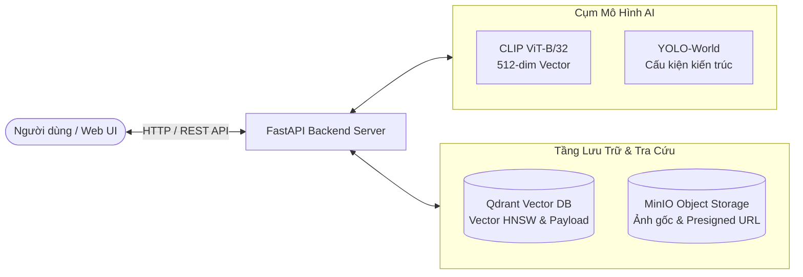

# 🏛️ KIS Architect - Kho Tư Liệu Kiến Trúc Việt Nam

Hệ thống **KIS Architect (Kho Tư Liệu Kiến Trúc Việt Nam)** là giải pháp tìm kiếm và quản lý kho tư liệu hình ảnh công trình kiến trúc Việt Nam dựa trên nội dung và ngữ nghĩa (Content-Based Image Retrieval - CBIR).

Hệ thống tích hợp mô hình AI đa phương thức **CLIP (ViT-B/32)** cho phép tìm kiếm theo văn bản mô tả (Text-to-Image) hoặc hình ảnh tương đồng (Image-to-Image), kết hợp với mô hình nhận diện cấu kiện kiến trúc mở **YOLO-World** cùng cơ sở dữ liệu vector **Qdrant** và hệ thống lưu trữ **MinIO S3**.

> 📖 **Xem chi tiết thiết kế hệ thống chuyên sâu tại:** [SYSTEM_ARCHITECTURE.md](file:///d:/Study/Postgrad/HK2/AAI&DM/KIS/SYSTEM_ARCHITECTURE.md)  
> 📑 **Xem bản thảo đề tài nghiên cứu tại:** [PROJECT_PROPOSAL.md](file:///d:/Study/Postgrad/HK2/AAI&DM/KIS/PROJECT_PROPOSAL.md)

---

## 🛠️ Kiến Trúc Hệ Thống Tinh Gọn


```mermaid
flowchart LR
    User([Người dùng / Web UI]) <-->|HTTP / REST API| FastAPI[FastAPI Backend Server]
    
    subgraph AI_Layer ["Cụm Mô Hình AI"]
        CLIP[CLIP ViT-B/32<br>512-dim Vector]
        YOLO[YOLO-World<br>Cấu kiện kiến trúc]
    end
    
    subgraph Storage_Layer ["Tầng Lưu Trữ & Tra Cứu"]
        Qdrant[(Qdrant Vector DB<br>Vector HNSW & Payload)]
        MinIO[(MinIO Object Storage<br>Ảnh gốc & Presigned URL)]
    end
    
    FastAPI <--> AI_Layer
    FastAPI <--> Storage_Layer
```

---

## 🚀 Hướng Dẫn Khởi Chạy

### 1. Khởi chạy cụm dịch vụ CSDL (Docker)
Khởi động **Qdrant** và **MinIO** ở chế độ nền:
```bash
docker-compose up -d
```
* **Qdrant Vector DB:** `http://localhost:6333/dashboard`
* **MinIO Console:** `http://localhost:9001` (User/Pass: `minioadmin` / `minioadmin`)

### 2. Cài đặt thư viện Python
```bash
pip install -r requirements.txt
```

### 3. Khởi chạy Backend Server (FastAPI)
```bash
cd backend
python -m uvicorn app.main:app --host 0.0.0.0 --port 8000
```
* **API Documentation (Swagger UI):** `http://localhost:8000/docs`

### 4. Khởi chạy Giao diện Frontend
```bash
cd frontend
python -m http.server 5500
```
Truy cập: **`http://localhost:5500`** trên trình duyệt để sử dụng hệ thống.

---

## 📥 Quy Trình Thu Thập & Lập Chỉ Mục Dữ Liệu (Offline Pipeline)

1. **Thu thập ảnh kiến trúc từ Wikimedia Commons:**
   ```bash
   python scripts/download_commons_images.py
   ```
   * Tự động tải ảnh chất lượng cao và siêu dữ liệu (tên di tích, tọa độ GPS, mô tả) vào thư mục `data/vietnam_architecture/`.

2. **Lập chỉ mục và nạp vào MinIO & Qdrant:**
   ```bash
   python scripts/reindex_with_metadata.py
   ```
   * Tải ảnh gốc lên MinIO bucket `kis-keyframes`.
   * Trích xuất vector 512 chiều bằng CLIP.
   * Phát hiện các cấu kiện kiến trúc bằng YOLO-World (*bell tower, stone statue, wooden column, curved roof, temple gate*).
   * Lưu toàn bộ vector và siêu dữ liệu vào Qdrant.

---

## 💡 Hướng Dẫn Sử Dụng Các Tính Năng

* **🔍 Tìm kiếm bằng mô tả (Text-to-Image):** Nhập câu mô tả không gian kiến trúc bằng tiếng Anh (ví dụ: *"Traditional Vietnamese temple architecture under sunlight"* hoặc *"Modern tropical house facade with wooden louvers"*).
* **🖼️ Tìm kiếm bằng ảnh mẫu (Image-to-Image):** Chọn file ảnh hoặc **nhấn `Ctrl+V / Cmd+V` để dán ảnh trực tiếp từ clipboard**.
* **🏛️ Lọc theo cấu kiện kiến trúc (YOLO-World Filter):** Bấm chọn nhanh các nhãn gợi ý (*curved roof, wooden column, stone statue, temple gate, bell tower*) để lọc chính xác công trình có chứa cấu kiện mong muốn.
* **📋 Xem chi tiết công trình:** Nhấp vào bất kỳ bức ảnh nào để mở modal chi tiết: xem ảnh gốc phân giải cao, tên công trình, bài viết mô tả di tích, tọa độ địa lý, tác giả và cấu kiện AI nhận diện được.
