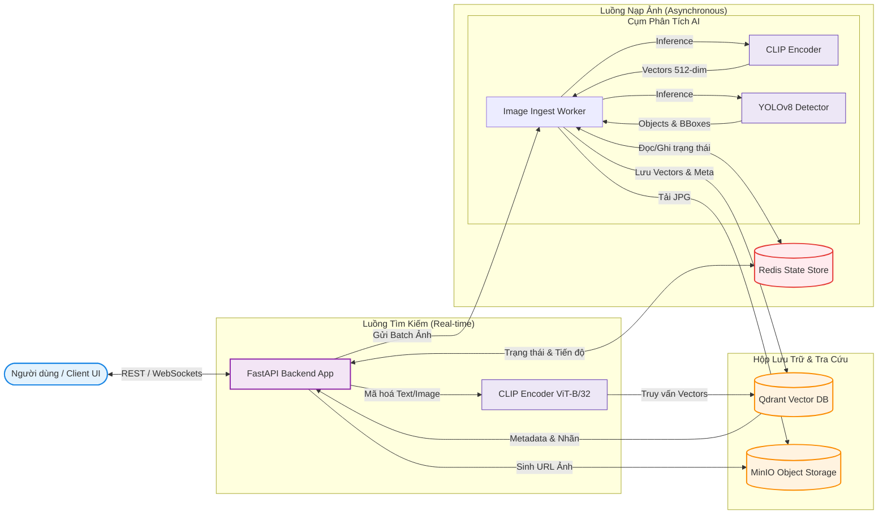

# 🏛️ KIS Architect - Kho Tư Liệu Kiến Trúc Việt Nam

Hệ thống **KIS Architect (Kiến trúc Việt Nam)** cho phép người dùng tìm kiếm và lưu trữ hình ảnh các công trình kiến trúc Việt Nam dựa trên mô tả văn bản (Semantic Search) và hình ảnh tương đương (Image-to-Image Search), kết hợp với các bộ lọc nhận diện vật thể (Object-based Filtering bằng YOLOv8).

Dự án bao gồm cả hệ thống **Nạp Ảnh tự động bất đồng bộ (Automated Image Ingest Pipeline)**, tích hợp mô hình AI nhúng (CLIP ViT-B/32) để trích xuất ngữ nghĩa và nhận diện đối tượng kiến trúc, con người, phương tiện (YOLOv8).

---

## 🛠️ Kiến trúc Hệ thống Toàn diện

Hệ thống được thiết kế theo mô hình Microservices phân tán. Sơ đồ kiến trúc toàn hệ thống bao gồm:


```mermaid
graph LR
    %% Clients and API Gateway
    User([Người dùng / Client UI]) <-->|REST / WebSockets| FastAPI_App[FastAPI Backend App]
    
    %% Cache & State
    FastAPI_App <-->|Trạng thái & Tiến độ| Redis[(Redis State Store)]
    
    %% Storage Layer
    subgraph Storage_Layer ["Hộp Lưu Trữ & Tra Cứu"]
        Qdrant[(Qdrant Vector DB)]
        MinIO[(MinIO Object Storage)]
    end

    %% Search Engine
    subgraph Search_Engine ["Luồng Tìm Kiếm (Real-time)"]
        FastAPI_App -->|Mã hoá Text/Image| CLIP_Query[CLIP Encoder ViT-B/32]
        CLIP_Query -->|Truy vấn Vectors| Qdrant
        Qdrant -->|Metadata & Nhãn| FastAPI_App
        FastAPI_App -->|Sinh URL Ảnh| MinIO
    end
    
    %% Ingest Pipeline
    subgraph Ingest_Pipeline ["Luồng Nạp Ảnh (Asynchronous)"]
        FastAPI_App -->|Gửi Batch Ảnh| IngestWorker[Image Ingest Worker]
        
        IngestWorker <-->|Đọc/Ghi trạng thái| Redis
        
        subgraph AI_Inference ["Cụm Phân Tích AI"]
            IngestWorker -->|Inference| CLIP_Embedder[CLIP Encoder]
            IngestWorker -->|Inference| YOLO_Detector[YOLOv8 Detector]
        end
        
        CLIP_Embedder -->|Vectors 512-dim| IngestWorker
        YOLO_Detector -->|Objects & BBoxes| IngestWorker
        
        IngestWorker -->|Tải JPG| MinIO
        IngestWorker -->|Lưu Vectors & Meta| Qdrant
    end

    %% --- STYLING (Modern & Clean Color Palette) ---
    classDef client fill:#E3F2FD,stroke:#1E88E5,stroke-width:2px;
    classDef gateway fill:#F3E5F5,stroke:#8E24AA,stroke-width:2px;
    classDef cache fill:#FFEBEE,stroke:#E53935,stroke-width:2px;
    classDef storage fill:#FFF3E0,stroke:#FB8C00,stroke-width:2px;
    classDef ai fill:#EDE7F6,stroke:#5E35B1,stroke-width:1px;

    class User client;
    class FastAPI_App gateway;
    class Redis cache;
    class Qdrant,MinIO storage;
    class CLIP_Query,CLIP_Embedder,YOLO_Detector ai;
```

### Chi tiết các phân lớp:

1. **Lớp Giao diện (Frontend - Web UI)**:
   * **Phần Tìm kiếm**: Form nhập mô tả bằng văn bản hoặc tải lên ảnh tương đương, đi kèm ô lọc theo nhãn vật thể (Hybrid Search). Kết quả hiển thị dạng Grid phân trang trực quan.
   * **Phần Nạp Ảnh**: Hỗ trợ chọn hàng loạt ảnh kiến trúc từ máy tính. Có bảng theo dõi tiến độ thời gian thực (được đẩy liên tục từ WebSocket).
2. **Lớp Gateway & API (FastAPI Backend)**:
   * **Search Controller**: Nhận yêu cầu tìm kiếm, gửi truy vấn đến CLIP dịch sang vector, sau đó gọi Qdrant. Hỗ trợ Qdrant `query_points` API mới nhất (v1.18+).
   * **Ingestion Controller**: Nhận mảng các tệp (FormData), tạo mã tác vụ và đẩy vào luồng Worker.
   * **WebSocket Server**: Theo dõi thay đổi trạng thái tiến trình nạp trong Redis và stream trực tiếp đến Frontend.
3. **Lớp Ingest Worker & AI Inference**:
   * **YOLOv8**: Nhận diện 80 lớp vật thể phổ biến (người, xe cộ, cây cối, nội thất,...), trả về tọa độ bounding box chuẩn hóa để phục vụ bộ lọc không gian kiến trúc.
   * **CLIP**: Chuyển đổi hình ảnh thành vector 512 dimensions đại diện cho ngữ nghĩa hình ảnh kiến trúc.
4. **Lớp Lưu trữ dữ liệu (Storage Tier)**:
   * **MinIO**: Phục vụ lưu trữ tệp ảnh kiến trúc hiệu năng cao.
   * **Qdrant**: Cơ sở dữ liệu Vector lưu trữ embeddings và payload metadata cho việc tìm kiếm lai.

---

## 🚀 Hướng dẫn Cài đặt & Chạy Hệ thống

### 1. Thu thập dữ liệu kiến trúc tự động (Tùy chọn)
Dự án đi kèm bộ Script tải tự động ảnh Kiến trúc Việt Nam từ Wikimedia Commons bằng PetScan API:
```bash
python scripts/download_commons_images.py
```
*(Script này sẽ tải ảnh vào thư mục `data/raw_images` để bạn có sẵn kho ảnh nạp vào hệ thống)*

### 2. Khởi chạy cụm dịch vụ CSDL (Docker)
Khởi động Qdrant, MinIO, và Redis ở chế độ nền:
```bash
docker compose up -d
```
*(Hạ tầng sẽ tự động khởi tạo bucket `kis-keyframes` (mặc định) trong MinIO).*

### 3. Cài đặt Backend Server
Cài đặt dependencies cho ứng dụng Python:
```bash
cd backend
pip install -r requirements.txt
```
Khởi chạy AI FastAPI Server:
```bash
python run.py
```
* **API Documentation**: `http://localhost:8000/docs`

### 4. Khởi chạy Giao diện (Frontend)
Di chuyển vào thư mục `frontend` và chạy một server tĩnh (ví dụ: cổng `5500`):
```bash
cd frontend
python3 -m http.server 5500
```
Truy cập: `http://localhost:5500` trên trình duyệt để sử dụng hệ thống!

---

## 💡 Hướng dẫn Sử dụng các Chức năng

Giao diện Frontend được thiết kế dạng Tab mượt mà:

### Tab 1: 🔍 Tìm kiếm Không Gian (CLIP + YOLO Hybrid Search)
* **Tìm kiếm bằng Văn bản (Semantic Search)**: Nhập mô tả phân cảnh bằng tiếng Anh (ví dụ: `ancient temple with curved roof`, `yellow colonial french building`).
* **Tìm kiếm bằng Hình ảnh (Image-to-Image)**: Tải lên một bức ảnh kiến trúc, hệ thống sẽ nhúng ảnh qua CLIP và tìm các công trình tương đồng về đường nét, phong cách thiết kế.
* **Lọc theo Đối tượng (Object Filter)**: Nhập danh sách nhãn vật thể do YOLO phát hiện (ví dụ: `person`, `car`, `chair`). Hệ thống sẽ thực thi tìm kiếm lai lọc trước (hybrid pre-filtering) trên Qdrant.

### Tab 2: 📥 Nạp Kho Ảnh (Asynchronous Ingest Pipeline)
* **Nạp Tệp Hàng Loạt (Batch Upload)**: Bấm "Chọn Tệp" và bôi đen hàng chục bức ảnh kiến trúc cùng lúc. 
* **Giám sát thời gian thực**: Theo dõi danh sách tác vụ đang phân tích thông qua bảng trạng thái cập nhật liên tục bằng kết nối **WebSocket**.
* **🚫 Nút Hủy (Cancel)**: Hủy ngay lập tức luồng phân tích của một mẻ ảnh bất kỳ lúc nào, giải phóng CPU/GPU và tự động dọn dẹp các tệp ảnh trên MinIO & Qdrant.

---

## 📊 Thiết kế Payload Qdrant Database

Mỗi điểm vector trong Qdrant được lưu trữ theo cấu trúc:
```json
{
  "id": "e4a7a8d5-12a8-48b6-96a1-a47781b2a95c",  // Định dạng UUID chuỗi chuẩn Qdrant
  "vector": [512 dimensions],                   // Vector CLIP ViT-B/32
  "payload": {
    "original_id": "ARCH_2B7DBA37_002_Grave_khai_dinh",
    "video_id": "Bộ sưu tập Kiến Trúc",
    "keyframe_name": "Grave_khai_dinh.jpg",
    "jpg_path": "architecture/ARCH_2B7DBA37/Grave_khai_dinh.jpg", 
    "batch": "ARCH_2B7DBA37",
    "objects": [                                // Danh sách vật thể do YOLOv8 nhận diện
      {
        "label": "person",
        "confidence": 0.5213,
        "bbox": [0.3924, 0.5097, 0.4188, 0.591] // Bounding Box chuẩn hóa [x1, y1, x2, y2]
      }
    ],
    "object_labels": ["person"],                // Phục vụ truy vấn nhanh MatchAny
    "object_count": 1,
    "has_objects": true
  }
}
```
