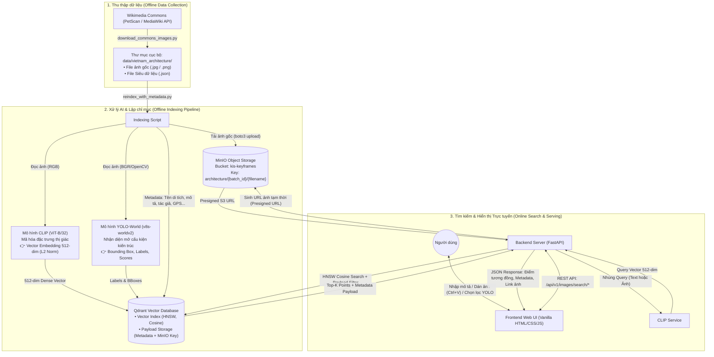

# 🏛️ KIẾN TRÚC HỆ THỐNG KIS ARCHITECT
## Hệ Thống Quản Lý & Truy Xuất Ngữ Nghĩa Kho Tư Liệu Kiến Trúc Việt Nam

> Tài liệu mô tả chuyên sâu kiến trúc hệ thống tinh gọn của **KIS Architect**, tập trung phân tích chi tiết vai trò, cơ chế hoạt động và cách thức phối hợp giữa các thành phần công nghệ cốt lõi: **MinIO Object Storage**, **Qdrant Vector Database**, **CLIP Model**, **YOLO-World Model**, **FastAPI Backend**, và **Web Frontend**.

---

## 1. Sơ Đồ Kiến Trúc Tổng Thể



---

## 2. Chi Tiết Từng Thành Phần Trong Kiến Trúc

### 2.1. MinIO Object Storage (Kho Lưu Trữ Đối Tượng Chuẩn S3)

**MinIO** đóng vai trò là tầng lưu trữ tập trung (Centralized Object Storage Layer) cho toàn bộ tài nguyên hình ảnh độ phân giải cao của hệ thống.

* **Lý do sử dụng MinIO thay vì lưu local disk hay lưu blob trong Database:**
  * **Tách biệt tầng tính toán và lưu trữ (Decoupling Compute & Storage):** Tránh việc server database bị phình to (bloated) khi lưu hàng ngàn file ảnh dung lượng lớn, giúp database chỉ tập trung vào đánh chỉ mục và tìm kiếm nhanh.
  * **Chuẩn hóa API tương thích Amazon S3:** Dễ dàng chuyển dịch lên hạ tầng Cloud (AWS S3, Google Cloud Storage) trong tương lai mà không phải sửa đổi code ứng dụng.
  * **Hiệu năng I/O cao:** MinIO được viết bằng Go, tối ưu hóa đọc/ghi song song cực nhanh, hỗ trợ phân tán và khả năng mở rộng (high scalability).
* **Cấu trúc lưu trữ:**
  * **Bucket chính:** `kis-keyframes`
  * **Khóa đối tượng (Object Key):** Được tổ chức theo tiền tố:
    ```
    architecture/{batch_id}/{filename}
    Ví dụ: architecture/ARCH_EAF319B2/Chua_Mot_Cot_Hanoi.jpg
    ```
* **Cơ chế Presigned URL bảo mật:**
  * Thay vì mở public toàn bộ bucket (tiềm ẩn nguy cơ lộ tài nguyên), hệ thống sử dụng cơ chế **Presigned URL** thông qua thư viện `boto3`.
  * Mỗi khi có kết quả tìm kiếm, Backend gọi hàm `generate_presigned_url(jpg_path, expires_in=3600)` để tạo một đường link truy cập tạm thời có chữ ký bảo mật (hết hạn sau 1 giờ), cho phép trình duyệt tải ảnh trực tiếp từ MinIO mà không cần xác thực phức tạp.
  * Hệ thống cũng cung cấp endpoint proxy `/api/v1/images/keyframes/{path}` tự động chuyển hướng (`307 Temporary Redirect`) đến Presigned URL của MinIO.
* **Tự động khởi tạo (Container `mc_helper`):**
  * Trong `docker-compose.yml`, một container phụ trợ (`minio/mc`) được cấu hình để tự động kiểm tra sự tồn tại của bucket `kis-keyframes` và khởi tạo tự động khi container MinIO khởi động lần đầu.

---

### 2.2. Qdrant Vector Database (Cơ Sở Dữ Liệu Vector & Lọc Siêu Dữ Liệu)

**Qdrant** là cơ sở dữ liệu vector chuyên dụng (Vector Search Engine) chịu trách nhiệm đánh chỉ mục và truy vấn tương đồng không gian vector ở quy mô lớn với độ trễ tính bằng mili-giây.

* **Cấu hình Collection (`video_keyframes`):**
  * **Kích thước Vector (Vector Dimension):** `512` chiều (tương thích chuẩn không gian đặc trưng của mô hình CLIP ViT-B/32).
  * **Hàm đo khoảng cách (Distance Metric):** `Cosine Similarity` (đo góc giữa 2 vector trong không gian đa chiều, giá trị trong khoảng $[-1, 1]$).
  * **Cơ chế lập chỉ mục HNSW (Hierarchical Navigable Small World):** Xây dựng đồ thị đa tầng liên kết các điểm vector lân cận, cho phép thuật toán tìm kiếm Nearest Neighbor đạt độ phức tạp xấp xỉ $O(\log N)$ thay vì quét toàn bộ dữ liệu ($O(N)$).
* **Cấu trúc Siêu dữ liệu (Payload Schema):**
  Mỗi điểm dữ liệu (Point) trong Qdrant bao gồm ID duy nhất (UUID), Vector 512 chiều, và Payload dạng JSON lưu trữ toàn diện thông tin:
  ```json
  {
    "original_id": "ARCH_EAF319B2_001_Chua_Mot_Cot",
    "batch": "ARCH_EAF319B2",
    "jpg_path": "architecture/ARCH_EAF319B2/Chua_Mot_Cot.jpg",
    "monument_name": "Chùa Một Cột",
    "description": "Chùa Một Cột (Diên Hựu tự) xây dựng năm 1049 thời vua Lý Thái Tông...",
    "categories": ["Chùa Hà Nội", "Kiến trúc thời Lý", "Di tích quốc gia đặc biệt"],
    "date": "2023-11-15",
    "author": "Nguyễn Văn A",
    "source_url": "https://commons.wikimedia.org/wiki/File:Chua_Mot_Cot.jpg",
    "latitude": 21.0358,
    "longitude": 105.8336,
    "object_labels": ["curved roof", "wooden column", "stone statue"],
    "object_count": 3,
    "has_objects": true,
    "objects": [
      {
        "label": "curved roof",
        "display_name": "Mái ngói cong / Mái đao",
        "confidence": 0.88,
        "bbox": [0.15, 0.22, 0.85, 0.58]
      }
    ]
  }
  ```
* **Cơ chế Tìm kiếm Kết hợp (Hybrid Filtering):**
  * Qdrant hỗ trợ vừa tìm kiếm theo khoảng cách vector (Vector Similarity), vừa áp dụng bộ lọc điều kiện (Payload Filter) cùng một lúc.
  * Khi người dùng chọn lọc theo cấu kiện kiến trúc (ví dụ: chỉ tìm các ảnh có `wooden column` hoặc `curved roof`), Qdrant áp dụng `FieldCondition(key="object_labels", match=MatchAny(values=[...]))` trực tiếp trong giai đoạn duyệt đồ thị HNSW, loại bỏ ngay các điểm không thỏa mãn mà không làm suy giảm tốc độ truy vấn.

---

### 2.3. Mô Hình Thị Giác Đa Phương Thức CLIP (OpenAI ViT-B/32)

**CLIP (Contrastive Language-Image Pre-Training)** là trái tim AI của hệ thống tìm kiếm ngữ nghĩa:

* **Không gian nhúng chung (Joint Multimodal Embedding Space):**
  * CLIP gồm 2 mạng Transformer riêng biệt: **Image Encoder** (dùng Vision Transformer ViT-B/32) và **Text Encoder**.
  * Cả hai mạng đều chiếu đầu ra về cùng một không gian vector 512 chiều được chuẩn hóa độ dài ($L_2\text{-norm} = 1$). Nhờ đó, tích vô hướng giữa vector Text và vector Image tương đương trực tiếp với độ tương đồng ngữ nghĩa (Cosine Similarity).
* **Khả năng thấu hiểu kiến trúc vượt trội:**
  * Nhận diện xuất sắc các khái niệm trừu tượng: Phong cách kiến trúc (*traditional, modernist, colonial, indochine, brutalist, minimal*).
  * Nhận diện vật liệu thô: *concrete walls, carved wood, red roof tiles, bamboo, natural stone*.
  * Nhận diện điều kiện không gian & ánh sáng: *direct sunlight, evening shadow, twilight, open courtyard, airy interior*.
* **Vai trò trong luồng:**
  * **Offline:** Mã hóa toàn bộ ảnh tư liệu trong kho thành các vector 512 chiều để nạp vào Qdrant.
  * **Online:** Nhận câu mô tả tiếng Anh hoặc ảnh mẫu người dùng gửi lên, tức thì mã hóa thành vector 512 chiều để gửi sang Qdrant truy vấn.

---

### 2.4. Mô Hình Nhận Diện Cấu Kiện Mở YOLO-World (v8s-worldv2)

**YOLO-World** giải quyết triệt để hạn chế "mù chi tiết nhỏ" của các mô hình tìm kiếm tổng quan:

* **Khác biệt cốt lõi so với YOLO truyền thống:**
  * YOLO thông thường chỉ nhận diện được 80 lớp cố định của tập dữ liệu COCO (chó, mèo, ô tô,... hoàn toàn không có nhãn về kiến trúc).
  * **YOLO-World** sử dụng cơ chế phát hiện từ vựng mở (Open-Vocabulary Object Detection). Nó kết hợp Text Encoder với Vision Backbone để nhận diện bất kỳ nhãn nào được cung cấp động mà không cần phải huấn luyện lại mô hình (Zero-shot Detection).
* **Từ vựng kiến trúc Việt Nam chuyên biệt:**
  Trong [`yolo_service.py`](file:///d:/Study/Postgrad/HK2/AAI&DM/KIS/backend/app/services/yolo_service.py), hệ thống nạp trước danh mục các cấu kiện kiến trúc đặc thù:
  * `bell tower` (Gác chuông / Tháp)
  * `stone statue` (Tượng đá / Bia đá)
  * `wooden column` (Cột gỗ)
  * `curved roof` (Mái cong / Mái đao)
  * `temple gate` (Cổng tam quan)
  * `steeple` (Tháp nhọn)
  * `pagoda` (Chùa / Tháp Phật)
  * `courtyard` (Sân trong / Giếng trời)
  * `corridor` (Hành lang)
  * `dragon carving` (Chạm khắc rồng)
* **Kết quả nhận diện:**
  Trả về tọa độ chuẩn hóa Bounding Box `[x_min, y_min, x_max, y_max]`, nhãn phân loại và điểm tự tin (`confidence`). Dữ liệu này được lưu vào Qdrant để người dùng có thể lọc chính xác chi tiết công trình trên giao diện.

---

### 2.5. Máy Chủ Ứng Dụng Backend (FastAPI)

Xây dựng trên nền tảng **FastAPI (Python)** hiện đại, bất đồng bộ (`async`/`await`), nhẹ và tối ưu hóa hiệu năng cao:

* **Các Endpoint chính:**
  * `GET /health` & `GET /health/qdrant`: Kiểm tra tình trạng hoạt động của server và cơ sở dữ liệu vector.
  * `POST /api/v1/images/search/text`: Tìm kiếm theo danh sách câu mô tả văn bản (`query_texts`), hỗ trợ kết hợp lọc nhãn (`object_filters`).
  * `POST /api/v1/images/search/image`: Tìm kiếm tương đồng theo ảnh mẫu gửi lên dạng Base64 (`image_base64`).
  * `GET /api/v1/images/keyframes/{path}`: Tự động điều hướng sang Presigned URL của MinIO để hiển thị ảnh nhanh.
* **Cơ chế xử lý:**
  * Điều phối giữa các mô hình AI (`clip_service`, `yolo_service`), database (`qdrant_client`), và kho lưu trữ (`minio_service`).
  * Đảm bảo chuẩn hóa dữ liệu đầu vào / đầu ra chặt chẽ qua Pydantic Schemas.
  * Cấu hình CORS mở rộng cho phép frontend kết nối mượt mà.

---

### 2.6. Giao Diện Người Dùng Frontend (Vanilla Web UI)

Được thiết kế theo tiêu chuẩn thẩm mỹ hiện đại dành riêng cho ngành kiến trúc:

* **Công nghệ:** HTML5 thuần, Vanilla CSS tùy biến cao (Glassmorphism, tông màu Slate/Cyan thanh lịch, font chữ thiết kế Plus Jakarta Sans và JetBrains Mono), JavaScript module không phụ thuộc framework nặng.
* **Trải nghiệm người dùng:**
  * **Tìm kiếm văn bản:** Ô nhập mô tả không gian kèm gợi ý mẫu phong phú.
  * **Tìm kiếm bằng ảnh:** Cho phép kéo thả file ảnh mẫu hoặc **nhấn `Ctrl+V / Cmd+V` để dán ảnh trực tiếp từ clipboard**.
  * **Bộ lọc cấu kiện kiến trúc:** Các thẻ gợi ý (Chips) tiện lợi để bấm chọn nhanh các cấu kiện như `stone statue`, `wooden column`, `curved roof`.
  * **Modal Chi Tiết Công Trình:** Khi bấm vào một bức ảnh, giao diện mở popup phân tích chi tiết: ảnh kích thước lớn, độ khớp (%), tên công trình, bài viết mô tả di tích lịch sử, phân loại thể loại, tác giả, niên đại và danh sách cấu kiện YOLO nhận diện được.

---

## 3. Bảng Tóm Tắt Vai Trò & Công Nghệ

| Lớp (Layer) | Công nghệ | Nhiệm vụ chính | Giao thức / Cổng |
| :--- | :--- | :--- | :--- |
| **Giao diện (Presentation)** | HTML5, CSS3, ES6 JS | Hiển thị kết quả tìm kiếm, tiếp nhận câu truy vấn, dán ảnh clipboard, popup di tích | HTTP: `5500` |
| **Máy chủ API (Application)** | FastAPI, Uvicorn, Pydantic | Tiếp nhận request, nhúng truy vấn, điều phối tìm kiếm và sinh URL ảnh | HTTP: `8000` |
| **AI Lõi (Semantic AI)** | CLIP ViT-B/32 (PyTorch) | Chuyển đổi ngôn ngữ tự nhiên và hình ảnh sang không gian vector 512 chiều | In-Process Python |
| **AI Bổ trợ (Object AI)** | YOLO-World (Ultralytics) | Nhận diện mở các cấu kiện kiến trúc Việt Nam phục vụ lọc chính xác | In-Process Python |
| **Vector DB (Retrieval)** | Qdrant Vector DB | Lưu trữ vector HNSW, tính Cosine Similarity, lọc Payload kết hợp | gRPC/HTTP: `6333` |
| **Kho đối tượng (Storage)** | MinIO Object Storage | Lưu trữ bền vững file ảnh gốc, sinh Presigned URL truy cập bảo mật | S3 API: `9000` / Web: `9001` |
| **Kịch bản ngoại tuyến (ETL)** | Python (`requests`, `boto3`, `cv2`) | Cào dữ liệu từ Wikimedia Commons và chạy nạp AI vào MinIO/Qdrant | CLI Scripts |

---

## 4. Các Thành Phần Đã Dọn Dẹp (Không Còn Trong Kiến Trúc)

Để đảm bảo hệ thống tinh gọn và tập trung 100% vào bài toán tìm kiếm tư liệu kiến trúc, các thành phần sau **đã được loại bỏ hoàn toàn**:
* ❌ **Redis:** Từng dùng để lưu trạng thái tạm và cờ hủy tác vụ nạp video nền.
* ❌ **Kafka & Zookeeper:** Từng dùng làm hàng đợi streaming tác vụ xử lý frame video.
* ❌ **Video Ingestion Workers (`yt-dlp`, SBD frame extraction):** Đã xóa để chuyển hoàn toàn sang nạp tư liệu ảnh kiến trúc tĩnh.
